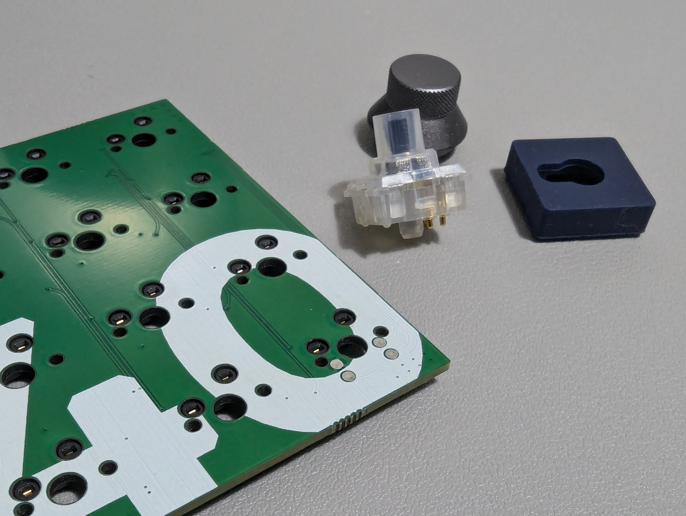
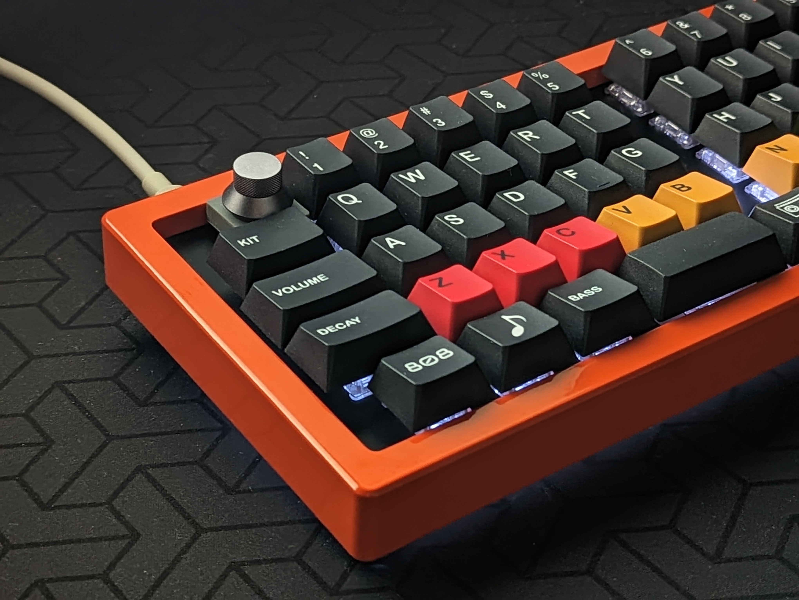

# 1U Rotary Encorder Switch FootPrint

FootPrint for rotary encoders (with switch function) whose mounting dimensions are compatible with CherryMX compatible switches widely used in mechanical keyboards.

## How to use

- Available for Kicad 8.0 or later.
- FootPrints can be installed on top of CherryMX switch footprints (HotSwap compatible) to enable exclusive use of keyswitches and rotary encoders.
- This is an exclusive Footprint for rotary encoders manufactured by Skyloong, which are distributed mainly by Aliexpress and other companies.
(The data is personally created based on actual size measurements and is in no way affiliated with Skyloong.)
https://github.com/JZ-Skyloong/Skyloong_Components/tree/main
- ENIG (Electro-less Nickel / Immersion Gold) is recommended for the surface treatment of the PCB when manufactured.
 

