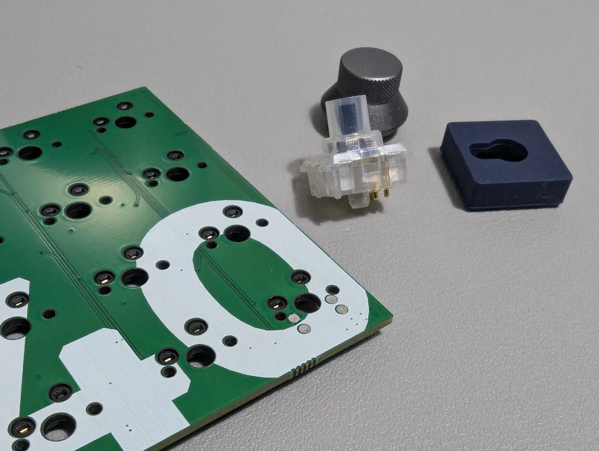
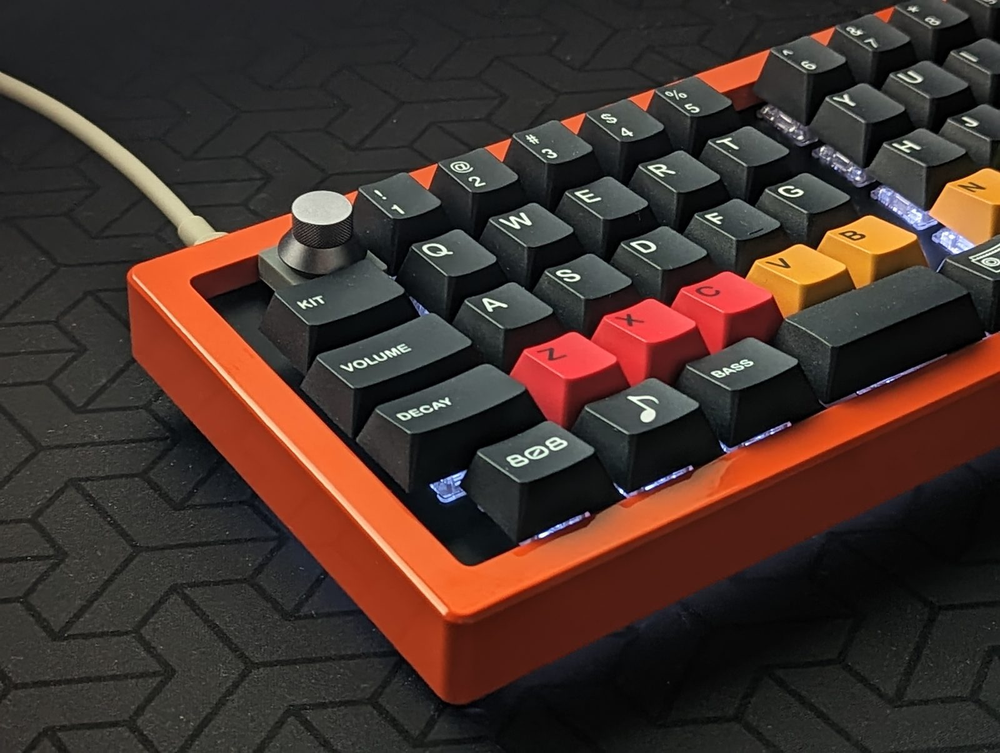

# 1U Rotary Encoder Switch — KiCad Library

*[日本語版はこちら](#日本語)*

KiCad symbol and footprint for a low-profile rotary encoder with a push
switch whose mounting dimensions are compatible with Cherry MX style
keyswitches widely used in mechanical keyboards.

The footprint can be placed directly on top of a Cherry MX switch
footprint (hotswap-compatible), allowing you to choose either a
keyswitch or a rotary encoder at the same position on the same PCB.

## Target component

This library is designed for the rotary encoder ("encoder key switch")
manufactured by Skyloong, commonly available on AliExpress and similar
platforms.

- Reference: [Skyloong_Components — encoder_key_switch](https://github.com/JZ-Skyloong/Skyloong_Components/tree/main)
- Datasheet: [encoder_key_switch_V1_05092023.pdf](https://github.com/JZ-Skyloong/Skyloong_Components/blob/main/encoder_key_switch/encoder_key_switch_V1_05092023.pdf)

The footprint was created independently based on actual measurements of
the part and is not affiliated with or endorsed by Skyloong.

## Contents

| File | Description |
|---|---|
| `1U_Rotary_Encoder_Switch.kicad_sym` | Symbol library (schematic symbol) |
| `1U_Rotary_Encoder_Switch.pretty/1U_Rotary_Encoder_Switch.kicad_mod` | Footprint library |

Requires KiCad 8.0 or later.

## Installation

1. Clone or download this repository.
2. **Symbol**: *Preferences → Manage Symbol Libraries…* → add
   `1U_Rotary_Encoder_Switch.kicad_sym`.
3. **Footprint**: *Preferences → Manage Footprint Libraries…* → add the
   `1U_Rotary_Encoder_Switch.pretty` folder.

With the default library nickname (`1U_Rotary_Encoder_Switch`), the
symbol's Footprint field resolves automatically.

## Pin mapping

| Pad | Symbol pin | Function |
|---|---|---|
| 1 | B | Encoder channel B |
| 2 | A | Encoder channel A |
| 3 | E | Push switch contact |
| 4 | C | Common |

As drawn in the symbol, the push switch closes between **C** and **E**;
the quadrature outputs are **A**/**B** referenced to the common **C**.
See the datasheet for electrical details and timing.

## Design notes

- The center hole (4.1 mm non-plated) accepts the encoder shaft; the
  four circular SMD pads solder to the encoder legs on the front side.
- The `Dwgs.User` layer shows the 1U key area (19.05 mm square) and the
  14 mm body corner marks for alignment with an MX switch footprint.
- Silkscreen is intentionally empty so the footprint can be stacked on
  top of an existing MX (hotswap) footprint without overlapping marks.
- For PCB manufacturing, an ENIG (Electroless Nickel / Immersion Gold)
  surface finish is recommended.

## License

Distributed under the
[CERN Open Hardware Licence Version 2 — Permissive](LICENSE)
(CERN-OHL-P-2.0). Provided as-is, without warranty of any kind; verify
the footprint against your actual parts before ordering PCBs.

---

## 日本語

メカニカルキーボードで広く使われる Cherry MX 互換スイッチと取り付け寸法に
互換性のある、プッシュスイッチ付きロータリーエンコーダ用の KiCad シンボル・
フットプリントです。

Cherry MX スイッチのフットプリント(ホットスワップ互換)の上に重ねて配置
できるため、同じ基板の同じ位置でキースイッチとロータリーエンコーダを選択
できます。

### 対象部品

Skyloong 製ロータリーエンコーダ(encoder key switch)向けです。AliExpress
などで入手できます。

- 参考: [Skyloong_Components — encoder_key_switch](https://github.com/JZ-Skyloong/Skyloong_Components/tree/main)
- データシート: [encoder_key_switch_V1_05092023.pdf](https://github.com/JZ-Skyloong/Skyloong_Components/blob/main/encoder_key_switch/encoder_key_switch_V1_05092023.pdf)

本フットプリントは実測に基づいて独自に作成したもので、Skyloong とは
無関係です(非公式)。

### 収録内容と導入方法

KiCad 8.0 以降に対応しています。

1. このリポジトリをクローンまたはダウンロードします。
2. **シンボル**: 「設定 → シンボルライブラリを管理…」で
   `1U_Rotary_Encoder_Switch.kicad_sym` を追加します。
3. **フットプリント**: 「設定 → フットプリントライブラリを管理…」で
   `1U_Rotary_Encoder_Switch.pretty` フォルダを追加します。

既定のライブラリニックネーム(`1U_Rotary_Encoder_Switch`)のままなら、
シンボルのフットプリント指定は自動で解決されます。

### ピン対応

| パッド | シンボルピン | 機能 |
|---|---|---|
| 1 | B | エンコーダ B 相 |
| 2 | A | エンコーダ A 相 |
| 3 | E | プッシュスイッチ接点 |
| 4 | C | コモン |

シンボルの結線どおり、プッシュスイッチは **C**–**E** 間で閉じます。
A/B 相はコモン **C** 基準の直交(クアドラチャ)出力です。電気的な詳細は
データシートを参照してください。

### 設計メモ

- 中央の穴(4.1 mm 非メッキ)にエンコーダのシャフトが入り、4つの円形
  SMD パッドに表面側で足をはんだ付けします。
- `Dwgs.User` レイヤーに 1U キー領域(19.05 mm 角)と 14 mm 本体のコーナー
  マークを描いてあり、MX スイッチフットプリントとの位置合わせに使えます。
- MX(ホットスワップ)フットプリントに重ねて使う前提のため、シルクは
  意図的に空にしています。
- 基板製造時は ENIG(無電解ニッケル/金フラッシュ)表面処理を推奨します。

### ライセンス

[CERN Open Hardware Licence Version 2 — Permissive](LICENSE)
(CERN-OHL-P-2.0)で配布します。無保証です。基板発注前に実部品との
整合を必ず確認してください。
